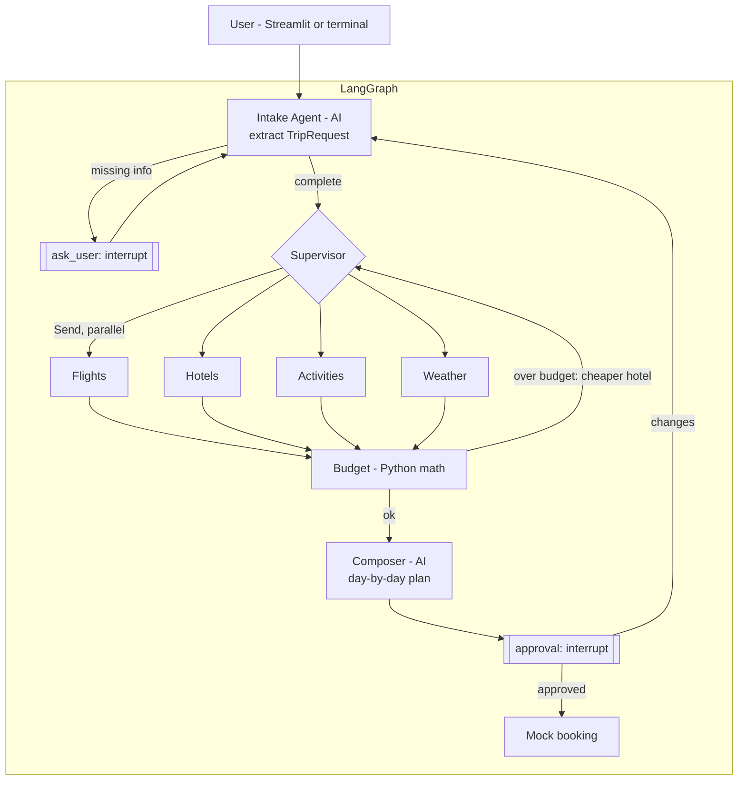

# TripPilot — Multi-Agent Travel Planner

> One prompt in, a complete trip plan out.
> *"5 days in Istanbul in December, $1500, I love food and history, vegetarian."*
> → flights + hotel + day-by-day itinerary + weather + budget → **you approve** → (mock) booked.

Portfolio goal: show that I can **build AI agents**: multi-agent orchestration with LangGraph,
tool calling, structured output, human-in-the-loop, and a small eval that proves the design
works. This is a CV project, not a commercial product: keep it simple, finish it, explain it well.

---

## 1. Tech Stack

| Layer | Choice | Why |
|---|---|---|
| Orchestration | **LangGraph** (supervisor + specialist agents) | Stateful graphs, parallel `Send`, interrupts |
| LLM framework | **LangChain** (`init_chat_model`, `@tool`, structured output) | Provider-agnostic |
| LLM | **Gemini** (`langchain-google-genai`) — swappable via `.env` | Free tier |
| Schemas | **Pydantic v2** | Typed trip data + structured LLM output |
| State saving | LangGraph `InMemorySaver` | Needed for interrupts (pause / resume) |
| Frontend | **Streamlit** | Chat + itinerary + approve button, calls the graph directly |
| Observability | **LangSmith** (optional) | Trace screenshots for the README |
| Evals | Small script with code checks | Real numbers for the CV |

### External data (free tiers / no key where possible)

| Need | API | Key? |
|---|---|---|
| Geocoding (city → lat/lon) | Open-Meteo Geocoding | No |
| Weather forecast / climate | **Open-Meteo** | No |
| Currency conversion | **Frankfurter** (ECB) + open.er-api.com | No |
| Attractions / food spots | OpenStreetMap **Overpass** | No |
| Airports (city → IATA) | **OurAirports** open dataset (cached CSV) | No |
| Flights & hotels search | SerpAPI (Google Flights / Hotels) — live data only | Free key |
| Booking | Mock: a function that returns fake confirmations | — |

---

## 2. Architecture



The shared state is `TripState` in `src/trippilot/state.py`.

---

## 3. Folder Structure

```
travel-planner/
├── PLAN.md
├── README.md                 # portfolio-facing: demo GIF, architecture, eval numbers
├── pyproject.toml / .env.example
├── src/trippilot/
│   ├── config.py, llm.py     # settings + model factory
│   ├── schemas.py            # Pydantic models
│   ├── state.py              # TripState
│   ├── graph.py              # wires the agents; terminal runner
│   ├── tools/                # API clients (no AI): geo, airports, weather, currency,
│   │                         #   places, flights, hotels, serpapi, errors, http, agent_tools
│   └── agents/               # single_agent (baseline), intake, supervisor, flights, hotels,
│                             #   activities, weather, budget, composer, approval, booking
├── ui/app.py                 # Streamlit
├── evals/                    # ~10 requests + run_evals.py
└── tests/
```

---

## 4. Implementation Phases

Each phase ends with something **runnable** and a **git commit**.

### Phase 0 — Project Setup ✅
- [x] 0.1 Folder structure, `pyproject.toml`, `.env.example`, `.gitignore`
- [x] 0.2 `git init` for this project (separate repo → separate GitHub link on CV)
- [x] 0.3 `config.py` (pydantic-settings) + `llm.py` model factory (Gemini default, swappable)
- [x] 0.4 Enable LangSmith tracing via env vars
- [ ] 0.5 *(optional)* Trace visible in LangSmith (needs a LangSmith key)

### Phase 1 — Tools Layer ✅
- [x] 1.1 `schemas.py`: `TripRequest`, `Money`, `FlightOption`, `HotelOption`, `Activity`, `WeatherSummary`, `BudgetReport`, `Itinerary`, `BookingConfirmation`
- [x] 1.2 `geo.py` — geocode city → lat/lon, country; `airports.py` — nearby airports from the **OurAirports** dataset (same-country first, all big city airports, e.g. `IST,SAW`)
- [x] 1.3 `weather.py` — Open-Meteo forecast (≤16 days) or same dates last year as an estimate
- [x] 1.4 `currency.py` — Frankfurter (ECB), open.er-api.com for non-ECB currencies (PKR, AED…) / fallback
- [x] 1.5 `places.py` — OSM Overpass attractions filtered by interests + dietary constraints (mirror server fallback)
- [x] 1.6 `flights.py` / `hotels.py` — SerpAPI Google Flights / Hotels, **live data only, no mock data**
- [x] 1.7 Shared: timeouts, typed errors
- [x] 1.8 Unit tests for every tool (mock HTTP via respx)

### Phase 2 — Single-Agent Baseline ✅
- [x] 2.1 One ReAct agent with all tools (`create_agent`) — `agents/single_agent.py`, tool wrappers in `tools/agent_tools.py`
- [x] 2.2 CLI runner: prompt in → rough plan out (`python -m trippilot.agents.single_agent "..."`)
- [x] 2.3 Failure modes noted (first run, no SerpAPI key, Istanbul 5 days, 8 tool calls, ~80 s):
  - Quoted "typical" flight/hotel prices despite the "never invent prices" rule
  - Took the heuristic activity costs at face value (e.g. a free monument at $10, Hagia Sophia at $0)
  - Free-form markdown budget, not structured or checkable

**Why this phase exists:** it's the baseline for the README's *"why multi-agent"* comparison.

### Phase 3 — Multi-Agent Graph ⭐ core
- [x] 3.1 `state.py` — `TripState`
- [x] 3.2 **Intake agent** — structured output → `TripRequest`; if fields are missing, asks the user (interrupt). Two nodes: `intake` (LLM) + `ask_user` (interrupt only, so resuming doesn't re-call the LLM)
- [x] 3.3 **Supervisor** — uses `Send` to run flight/hotel/activities/weather **in parallel**. Runs only specialists whose result is missing, so a replan re-runs just the affected one
- [x] 3.4 Specialist agents (flights, hotels, activities, weather). Decision: they call tools directly in Python (no LLM): inputs are fully known from `TripRequest`, so an LLM only adds cost and errors. Failures go to `state.errors` instead of crashing
- [x] 3.5 **Budget agent** — pure-Python math; picks cheapest flight + best-rated affordable hotel; food/transport are daily estimates. Over budget → drop paid sights, then replan hotels with a nightly `max_price` (only the hotel specialist re-runs), max 2 replans. Decision: no LLM here
- [x] 3.6 **Itinerary composer** — AI writes summary/days/packing tips (`ComposedPlan`); code fills flight, hotel, budget, costs, warnings and fixes dates + unknown activity ids
- [x] 3.7 `graph.py` — nodes, conditional edges, in-memory checkpointer, terminal runner
- [x] 3.8 Graph picture: `python -m trippilot.graph --draw` → `docs/graph.md` (Mermaid, rendered by GitHub)

**Done when:** a full request produces a valid `Itinerary`.

### Phase 4 — Approval & Mock Booking (1 day)
- [x] 4.1 **Approval node** with `interrupt()` — shows the itinerary + total; the user approves or asks for changes
- [x] 4.2 Change request → back to intake with the user's message; all results are cleared (`errors` uses an `add_or_reset` reducer) and the trip is re-planned
- [x] 4.3 **Mock booking node** — creates `BookingConfirmation`s for flight + hotel (fake confirmation codes, no real service)
- [x] 4.4 Guardrail: booking is **only reachable** after approval (graph edges), plus a check inside the booking node

**Done when:** the graph never books without approval.

### Phase 5 — Streamlit UI (1–2 days)
- [x] 5.1 `ui/app.py` calls `build_graph()` directly (no separate backend)
- [x] 5.2 Chat input; intake questions shown in the chat
- [x] 5.3 Live status per agent (a step appears as each agent finishes) using `graph.stream`
- [x] 5.4 Itinerary per day, flight & hotel, budget metrics + table, map, warnings
- [x] 5.5 **Approve and book** button; any chat message at approval = change request; booking confirmation

**Done when:** the whole flow works in the browser.

### Phase 6 — Small Eval (1 day) ⭐ CV numbers come from here
- [ ] 6.1 `evals/dataset.jsonl` — ~10 requests (normal, tight budget, missing info, impossible)
- [ ] 6.2 Code checks: within budget, correct number of days, no invented places, dietary constraint respected, never books without approval
- [ ] 6.3 Run single-agent vs multi-agent on the same set → table in README (budget adherence, AI calls, time)

Note: the Gemini free tier is 20 requests/day per model, so run the eval over two days or with a lighter model.

**Done when:** `python evals/run_evals.py` prints a score table.

### Phase 7 — Ship & Showcase (1 day)
- [ ] 7.1 README: demo GIF, architecture diagram, graph picture, eval table, design decisions, limitations
- [x] 7.2 Deployed on Streamlit Community Cloud → https://trippilot.streamlit.app/
- [ ] 7.3 CV bullets (below)

---

## 5. Later (only if time — not needed for the CV)
- Long-term memory of preferences (LangGraph `Store`)
- Resume a trip later (SQLite checkpointer)
- FastAPI backend + streaming, Docker
- Retries and caching for the external APIs
- Prompt-injection guardrails, model routing (cheap vs strong model)
- Return flight details (second SerpAPI call), hotel neighborhood
- Expose the tools as an **MCP server**
- Export itinerary to PDF / calendar (.ics)

---

## 6. Timeline (remaining ≈ 4–5 days part-time)

| Days | Phases |
|---|---|
| 1 | 3.8, 4 |
| 2–3 | 5 |
| 4 | 6 |
| 5 | 7 |

---

## 7. CV Bullets (fill in real numbers after Phase 6)

- Built **TripPilot**, a multi-agent travel planner with **LangGraph**: an intake agent, a supervisor running **4 specialist agents in parallel**, a budget agent with automatic replanning, and an itinerary composer, over **6 external data sources**.
- Implemented **human-in-the-loop** with LangGraph interrupts (clarifying questions + plan approval); booking is unreachable without approval, enforced in the graph.
- Used **structured output** and code-side validation so the LLM never sets prices or dates; on a __-request eval, the multi-agent design kept __% of trips within budget vs __% for a single-agent baseline, with __× fewer LLM calls.

---

## 8. Progress Log

| Date | Phase | Notes |
|---|---|---|
| 2026-09-25 | — | Plan created |
| 2026-09-25 | 0 | Skeleton, uv project (py3.12), config + Gemini factory; smoke test OK. LangSmith key pending |
| 2026-09-25 | 1 | Tools layer, 35 tests. Decision: live APIs only (no mock flights/hotels); OurAirports for airport codes |
| 2026-10-01 | 1 | Removed retries & TTL caching for now (to revisit later) |
| 2026-10-01 | 2 | Single-agent baseline + CLI; first failure-mode notes |
| 2026-10-02 | — | Split tools/_common.py into tools/errors.py + tools/http.py |
| 2026-10-02 | 3 | State + intake agent + first graph.py (intake loop); unit-tested with a fake model. Real-model run pending: Gemini free tier is 20 requests/day |
| 2026-10-02 | 3 | Supervisor + 4 specialists (parallel via Send). Dev rule for now: no live runs, no new tests |
| 2026-10-02 | 3 | Budget agent + replan loop (budget → supervisor → hotels → budget) |
| 2026-10-02 | 3 | Itinerary composer (one AI call per trip) → full plan end to end |
| 2026-10-02 | — | Plan simplified for a CV project: dropped FastAPI, Docker, booking service, memory, hardening phase; moved them to "Later" |
| 2026-10-02 | 3, 4 | Graph diagram (`--draw`), approval interrupt + change requests, mock booking. Fixed terminal runner: plan/budget printing was missing |
| 2026-10-02 | 5 | Streamlit UI (`uv run streamlit run ui/app.py`); checked offline with AppTest, no live run yet |
