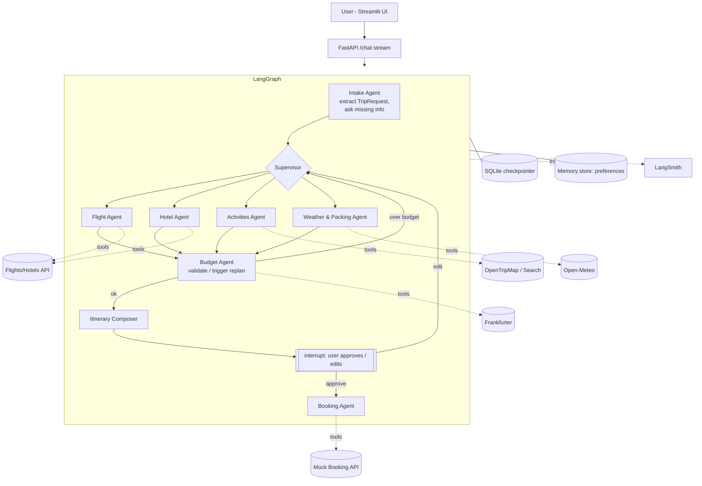

# TripPilot — Multi-Agent Travel Planner & Booking Agent

> One prompt in, a complete, bookable trip out.
> *"5 days in Istanbul in December, $1500, I love food and history, vegetarian."*
> → flights + hotel + day-by-day itinerary + weather + budget → **you approve** → booked.

Portfolio goal: show hiring managers that I can build a **production-style agentic system**
(multi-agent orchestration, tool calling, human-in-the-loop, memory, evals, observability,
deployment), not just a chatbot or a RAG demo.

---

## 1. Tech Stack

| Layer | Choice | Why |
|---|---|---|
| Orchestration | **LangGraph** (supervisor + sub-agents) | Stateful graphs, interrupts, checkpointing |
| LLM framework | **LangChain** (`init_chat_model`, `@tool`, structured output) | Provider-agnostic |
| LLM | **Gemini** (`langchain-google-genai`) — swappable via config | Already set up, free tier |
| Schemas | **Pydantic v2** | Typed trip state + structured LLM output |
| Persistence | `langgraph-checkpoint-sqlite` | Resume conversations, needed for interrupts |
| Long-term memory | LangGraph `Store` | Remembers user preferences across trips |
| Backend API | **FastAPI** | Mock booking service + agent API |
| Frontend | **Streamlit** | Chat + itinerary cards + map + approve button |
| Observability | **LangSmith** | Traces, token cost, latency per agent |
| Evals | LangSmith datasets + pytest | Measurable quality numbers for the CV |
| Packaging | `uv`/pip + **Docker** + docker-compose | One-command run |
| Deploy | Render / Railway / HF Spaces | Live demo URL |

### External data (free tiers / no key where possible)

| Need | API | Key? |
|---|---|---|
| Geocoding (city → lat/lon) | Open-Meteo Geocoding / Nominatim | No |
| Weather forecast / climate | **Open-Meteo** | No |
| Currency conversion | **Frankfurter** (ECB rates) | No |
| Attractions / POIs | OpenTripMap or Overpass (OSM) | Free key / No |
| Web search (events, tips) | Tavily or DuckDuckGo | Free key / No |
| Airports (city → IATA) | **OurAirports** open dataset (cached CSV) | No |
| Flights & hotels search | SerpAPI (Google Flights / Hotels) — live data only | Free key |
| Booking | **Our own mock Booking API** (FastAPI) | — |

> Booking is intentionally a mock service we build ourselves: real booking APIs need
> payment/commercial approval. Designing the booking API (idempotency keys, holds,
> confirmations, cancellation) is itself a portfolio talking point.

---

## 2. Architecture



### Core state (sketch)

```python
class TripRequest(BaseModel):
    origin: str | None
    destination: str
    start_date: date
    end_date: date
    travelers: int = 1
    budget: Money
    interests: list[str] = []
    constraints: list[str] = []      # "vegetarian", "no red-eye flights"

class TripState(TypedDict):
    messages: Annotated[list, add_messages]
    request: TripRequest | None
    flight_options: list[FlightOption]
    hotel_options: list[HotelOption]
    activities: list[Activity]
    weather: WeatherSummary | None
    budget_report: BudgetReport | None
    itinerary: Itinerary | None
    approval: Literal["pending", "approved", "changes_requested"] | None
    bookings: list[BookingConfirmation]
    replan_count: int
```

---

## 3. Folder Structure (target)

```
travel-planner/
├── PLAN.md
├── README.md                 # portfolio-facing: demo gif, architecture, metrics
├── pyproject.toml / requirements.txt
├── .env.example
├── Dockerfile
├── docker-compose.yml        # agent-api + booking-api + ui
├── src/trippilot/
│   ├── config.py             # settings, model selection
│   ├── llm.py                # chat model factory
│   ├── schemas.py            # Pydantic models
│   ├── state.py              # TripState
│   ├── tools/
│   │   ├── geo.py
│   │   ├── weather.py
│   │   ├── currency.py
│   │   ├── places.py
│   │   ├── airports.py       # OurAirports dataset (city → IATA)
│   │   ├── flights.py        # SerpAPI Google Flights
│   │   ├── hotels.py
│   │   └── booking.py        # client for mock booking API
│   ├── agents/
│   │   ├── intake.py
│   │   ├── supervisor.py
│   │   ├── flights.py
│   │   ├── hotels.py
│   │   ├── activities.py
│   │   ├── weather.py
│   │   ├── budget.py
│   │   ├── composer.py
│   │   └── booking.py
│   ├── graph.py              # builds & compiles the graph
│   ├── memory.py             # long-term preference store
│   └── api.py                # FastAPI: /chat (SSE), /threads, /approve
├── booking_service/
│   └── main.py               # mock booking FastAPI (holds, confirm, cancel)
├── ui/
│   └── app.py                # Streamlit
├── evals/
│   ├── dataset.jsonl         # 30-50 trip requests with expectations
│   ├── evaluators.py
│   └── run_evals.py
└── tests/
    ├── test_tools.py
    ├── test_budget.py
    └── test_graph.py
```

---

## 4. Implementation Phases

Each phase ends with something **runnable** and a **git commit**.

### Phase 0 — Project Setup (½ day)
- [x] 0.1 Create folder structure, `requirements.txt`, `.env.example`, `.gitignore`
- [x] 0.2 `git init` for this project (separate repo → separate GitHub link on CV)
- [x] 0.3 `config.py` (pydantic-settings) + `llm.py` model factory (Gemini default, swappable)
- [x] 0.4 Enable LangSmith tracing via env vars
- [ ] 0.5 Smoke test: model responds, trace visible in LangSmith

**Done when:** `python -m trippilot.llm` prints a reply and a trace appears.

### Phase 1 — Tools Layer (1–2 days)
- [x] 1.1 `schemas.py`: `TripRequest`, `Money`, `FlightOption`, `HotelOption`, `Activity`, `WeatherSummary`, `BudgetReport`, `Itinerary`, `BookingConfirmation`
- [x] 1.2 `geo.py` — geocode city → lat/lon, country; `airports.py` — nearby airports from the **OurAirports** dataset (same-country first, all big city airports, e.g. `IST,SAW`)
- [x] 1.3 `weather.py` — Open-Meteo forecast (≤16 days) or same dates last year as an estimate
- [x] 1.4 `currency.py` — Frankfurter (ECB), open.er-api.com for non-ECB currencies (PKR, AED…) / fallback
- [x] 1.5 `places.py` — OSM Overpass attractions filtered by interests + dietary constraints (mirror server fallback)
- [x] 1.6 `flights.py` / `hotels.py` — SerpAPI Google Flights / Hotels, **live data only, no mock data**
- [x] 1.7 Shared: timeouts, typed errors (retries & TTL caching deferred)
- [x] 1.8 Unit tests for every tool (mock HTTP via respx)

**Done when:** each tool is callable standalone and `pytest tests/test_tools.py` passes.

### Phase 2 — Single-Agent MVP (1 day)
- [x] 2.1 One ReAct agent with all tools (`create_agent`) — `agents/single_agent.py`, tool wrappers in `tools/agent_tools.py`
- [x] 2.2 CLI runner: prompt in → rough plan out (`python -m trippilot.agents.single_agent "..."`)
- [ ] 2.3 Note its failure modes (forgets budget, too many tool calls, inconsistent output)
  - First run (no SerpAPI key, Istanbul 5 days): 8 tool calls, ~80 s
  - Quoted "typical" flight/hotel prices despite the "never invent prices" rule
  - Took the heuristic activity costs at face value (e.g. a free monument at $10, Hagia Sophia at $0)
  - Planned 6 days for a 5-night trip, and the budget table is free-form markdown, not structured
  - Still to do: a run with a SerpAPI key to see flight/hotel choice vs budget

**Done when:** a basic plan is produced end-to-end.
**Why this phase exists:** it's the baseline for the README's *"why multi-agent"* comparison.

### Phase 3 — Multi-Agent Graph (3–4 days) ⭐ core
- [x] 3.1 `state.py` — `TripState`
- [x] 3.2 **Intake agent** — structured output → `TripRequest`; if fields are missing, asks the user (interrupt). Two nodes: `intake` (LLM) + `ask_user` (interrupt only, so resuming doesn't re-call the LLM)
- [x] 3.3 **Supervisor** — routes to specialists; uses `Send` to run flight/hotel/activities/weather **in parallel**. Runs only specialists whose result is missing, so a replan re-runs just the affected one
- [x] 3.4 Specialist agents (flights, hotels, activities, weather), each with only its own tools. Decision: they call tools directly in Python (no LLM): inputs are fully known from `TripRequest`, so an LLM only adds cost and errors. Failures go to `state.errors` instead of crashing. Packing tips move to the composer
- [x] 3.5 **Budget agent** — pure-Python math; picks cheapest flight + best-rated affordable hotel; food/transport are daily estimates. Over budget → drop paid sights, then replan hotels with a nightly `max_price` (only the hotel specialist re-runs), max 2 replans. Decision: no LLM here; the composer explains the budget (saves one AI call per trip)
- [ ] 3.6 **Itinerary composer** — day-by-day plan, grouped by neighborhood, respects weather (indoor on rainy days) and opening hours
- [ ] 3.7 `graph.py` — wire nodes, conditional edges, compile with SQLite checkpointer
- [ ] 3.8 Export graph PNG (`graph.get_graph().draw_mermaid_png()`) for README

**Done when:** a full request produces a valid `Itinerary` object within budget.

### Phase 4 — Human-in-the-Loop & Booking (2 days)
- [ ] 4.1 `booking_service/main.py` — mock API: `POST /holds`, `POST /bookings` (idempotency key), `GET /bookings/{id}`, `DELETE /bookings/{id}`
- [ ] 4.2 Approval node using LangGraph `interrupt()` — shows itinerary + total price
- [ ] 4.3 Resume with `Command(resume=...)`: approve / request changes ("cheaper hotel", "swap day 3")
- [ ] 4.4 **Booking agent** — books only after approval; handles partial failure (flight OK, hotel fails → retry / alternative / rollback)
- [ ] 4.5 Guardrail: booking tools are **unreachable** unless `approval == "approved"` (enforced in graph, not prompt)

**Done when:** the agent never books without approval, and a change request replans only the affected part.

### Phase 5 — Memory & Personalization (1 day)
- [ ] 5.1 Short-term: thread checkpointing (resume a trip later)
- [ ] 5.2 Long-term: LangGraph `Store` for preferences ("vegetarian", "window seat", "hates early flights")
- [ ] 5.3 Intake agent reads saved preferences; a node extracts new ones after each trip

**Done when:** a second trip automatically applies preferences from the first.

### Phase 6 — API & UI (2–3 days)
- [ ] 6.1 `api.py` — FastAPI: `POST /chat` (SSE streaming of agent steps), `POST /threads/{id}/resume`, `GET /threads/{id}`
- [ ] 6.2 Streamlit UI:
  - chat panel with **live agent status** ("✈️ Flight agent searching…")
  - itinerary cards per day, flight & hotel cards
  - map of activities (`st.map` / pydeck)
  - budget breakdown chart
  - **Approve / Request changes** buttons (drive the interrupt)
  - booking confirmation screen
- [ ] 6.3 Sidebar: past trips (threads), saved preferences

**Done when:** the whole flow works from the browser.

### Phase 7 — Evals & Observability (2 days) ⭐ CV numbers come from here
- [ ] 7.1 `evals/dataset.jsonl` — 30–50 requests (easy, tight budget, missing info, impossible requests, prompt-injection attempts)
- [ ] 7.2 Evaluators:
  - **Budget adherence** (code) — total ≤ budget
  - **Constraint satisfaction** (code + LLM judge) — dates, dietary, interests
  - **Itinerary quality** (LLM-as-judge rubric 1–5)
  - **Tool efficiency** — # tool calls, latency, $ cost per trip
  - **Safety** — never books without approval (must be 100%)
- [ ] 7.3 Compare: single-agent (Phase 2) vs multi-agent → table in README
- [ ] 7.4 LangSmith dashboards: cost & latency per agent

**Done when:** `python evals/run_evals.py` prints a score table.

### Phase 8 — Production Hardening (1–2 days)
- [ ] 8.1 Input guardrails (off-topic / prompt injection in user text and tool results)
- [ ] 8.2 Rate limiting + per-request token budget
- [ ] 8.3 Graceful degradation: API down → clear error / partial plan + a UI notice (no fake data)
- [ ] 8.4 Model routing: cheap model for extraction/routing, strong model for composing
- [ ] 8.5 Structured logging, `/health` endpoint
- [ ] 8.6 Tests for graph paths (approve, change request, over-budget replan, booking failure)

### Phase 9 — Ship & Showcase (1–2 days)
- [ ] 9.1 Dockerfile + docker-compose (agent-api, booking-api, ui)
- [ ] 9.2 GitHub Actions: lint (ruff) + tests
- [ ] 9.3 Deploy → live URL
- [ ] 9.4 README: demo GIF, architecture diagram, graph PNG, eval table, design decisions, limitations
- [ ] 9.5 2-minute demo video + LinkedIn post
- [ ] 9.6 CV bullets (below)

---

## 5. Stretch Goals (pick after v1)
- Voice input (Whisper) for the request
- Export itinerary to PDF / Google Calendar (.ics)
- Expose the tools as an **MCP server** (reuse knowledge from `../agentic-ai/mcp_demo/`)
- Multi-city trips
- Price-drop watcher (scheduled background agent)

---

## 6. Timeline (≈ 3–4 weeks part-time)

| Week | Phases |
|---|---|
| 1 | 0, 1, 2 |
| 2 | 3, 4 |
| 3 | 5, 6 |
| 4 | 7, 8, 9 |

---

## 7. CV Bullets (fill in real numbers after Phase 7)

- Built **TripPilot**, a multi-agent travel planning & booking system (LangGraph, LangChain, FastAPI, Streamlit) with a supervisor orchestrating **6 specialist agents** running in parallel over **7 external tools**.
- Implemented **human-in-the-loop approval** with LangGraph interrupts and graph-level guardrails, achieving **100% no-unauthorized-booking** on a __-case adversarial eval set.
- Designed an eval suite (LangSmith, LLM-as-judge + code evaluators): multi-agent design improved budget adherence from __% → __% and cut cost per trip by __% vs a single-agent baseline.
- Added long-term memory, SSE streaming, retries/fallbacks, and Dockerized deployment ( live demo: __ ).

---

## 8. Progress Log

| Date | Phase | Notes |
|---|---|---|
| 2026-09-25 | — | Plan created |
| 2026-09-25 | 0 | Skeleton, uv project (py3.12), config + Gemini factory; smoke test OK. LangSmith key pending |
| 2026-09-25 | 1 | Tools layer, 35 tests. Decision: live APIs only (no mock flights/hotels); OurAirports for airport codes |
| 2026-10-01 | 1 | Removed retries & TTL caching for now (to revisit later) |
| 2026-10-01 | 2 | Single-agent baseline + CLI; first failure-mode notes |
| 2026-10-02 | — | Split tools/_common.py into tools/errors.py + tools/http.py |
| 2026-10-02 | 3 | State + intake agent + first graph.py (intake loop); unit-tested with a fake model. Real-model run pending: Gemini free tier is 20 requests/day |
| 2026-10-02 | 3 | Supervisor + 4 specialists (parallel via Send). Dev rule for now: no live runs, no new tests |
| 2026-10-02 | 3 | Budget agent + replan loop (budget → supervisor → hotels → budget) |
