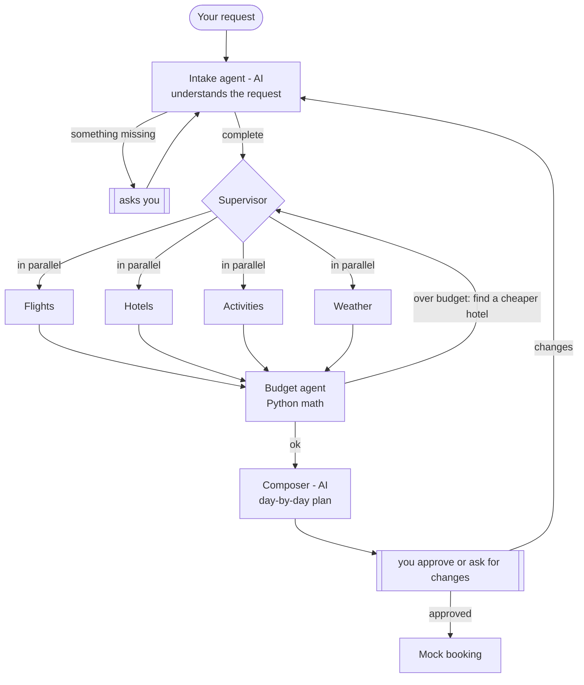

# TripPilot ✈️ — a multi-agent travel planner

One sentence in, a full trip plan out:

> *"Lahore to Istanbul, Dec 10-15, $1500, I love food and history, vegetarian"*
> → flights + hotel + weather + day-by-day itinerary + budget → **you approve** → (mock) booked.

**Live demo:** _link coming soon_ · Built with **LangGraph**, **LangChain**, **Gemini**, **Pydantic** and **Streamlit**.

## How it works



The full graph, generated from the code, is in [docs/graph.md](docs/graph.md).

| Agent | Uses AI? | Job |
|---|---|---|
| Intake | Yes | Turns free text into a structured `TripRequest`; asks for anything missing |
| Supervisor | No | Starts every specialist whose result is missing, **in parallel** (`Send`) |
| Flights, Hotels, Activities, Weather | No | Call live APIs (Google Flights/Hotels via SerpAPI, OpenStreetMap, Open-Meteo) |
| Budget | No | Adds up costs, converts currencies, triggers a cheaper-hotel **replan** when over budget |
| Composer | Yes | Writes the day-by-day plan: nearby sights together, indoor on rainy days |
| Approval → Booking | No | Pauses for the user; booking is reachable **only** after approval |

## Design decisions

- **AI only where judgment is needed.** Once the request is understood, searching flights is
  deterministic, so specialists call tools directly. A trip takes 2–3 LLM calls; the
  single-agent baseline in `agents/single_agent.py` needed ~9.
- **The LLM never sets prices or dates.** Structured output (Pydantic) for what the AI
  writes; code fills in prices, checks dates and removes places that were never found.
- **Human-in-the-loop with `interrupt()`.** Clarifying questions and plan approval pause
  the graph; the "never book without approval" rule is enforced by the graph edges.
- **Targeted replans.** An empty result means "work to do", so the budget agent re-runs
  only the hotel search, at most twice.
- **Failures don't crash the trip.** A failed API becomes a warning in the plan.

## Run it locally

```bash
uv sync
cp .env.example .env     # add GOOGLE_API_KEY; SERPAPI_API_KEY for flights & hotels
uv run streamlit run ui/app.py
```

Other entry points:

```bash
uv run python -m trippilot.graph "Lahore to Istanbul, Dec 10-15 2026, \$1500, food and history"
uv run python -m trippilot.agents.single_agent "..."   # single-agent baseline
uv run python -m trippilot.graph --draw                # regenerate docs/graph.md
uv run pytest
```

## Project layout

```
src/trippilot/
├── tools/     API clients, no AI (geo, airports, weather, currency, places, flights, hotels)
├── agents/    intake, supervisor, specialists, budget, composer, approval, booking
├── state.py   shared graph state      ├── schemas.py   Pydantic models
└── graph.py   wires the agents        ui/app.py        Streamlit app
```

## Limitations

- Booking is a mock: no real reservations are made.
- Food, local transport and sight costs are estimates.
- Return-flight times are not shown (needs a second SerpAPI request).
- The free Gemini tier allows 20 requests a day, so the demo may hit its limit.
