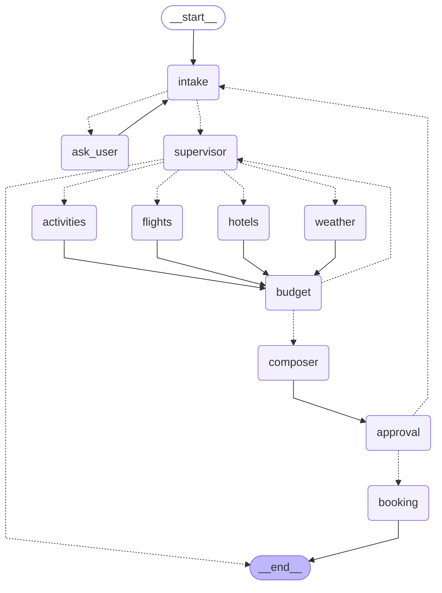

# TripPilot graph

```mermaid
---
config:
  flowchart:
    curve: linear
---
graph TD;
	__start__([<p>__start__</p>]):::first
	intake(intake)
	ask_user(ask_user)
	supervisor(supervisor)
	flights(flights)
	hotels(hotels)
	activities(activities)
	weather(weather)
	budget(budget)
	composer(composer)
	approval(approval)
	booking(booking)
	__end__([<p>__end__</p>]):::last
	__start__ --> intake;
	activities --> budget;
	approval -.-> booking;
	approval -.-> intake;
	ask_user --> intake;
	budget -.-> composer;
	budget -.-> supervisor;
	composer --> approval;
	flights --> budget;
	hotels --> budget;
	intake -.-> ask_user;
	intake -.-> supervisor;
	supervisor -.-> __end__;
	supervisor -.-> activities;
	supervisor -.-> flights;
	supervisor -.-> hotels;
	supervisor -.-> weather;
	weather --> budget;
	booking --> __end__;
	classDef default fill:#f2f0ff,line-height:1.2
	classDef first fill-opacity:0
	classDef last fill:#bfb6fc
```
